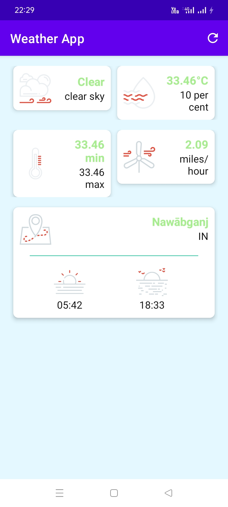

# <h1 align="center">Know The Weather</h1>

This app access current location and make OpenWeather API calling. After that, it tells  
about current weather data for any location on Earth including over 200,000 cities!  
I have made this app under guidance of Denis Panjuta Tutorials. 

<table align="center">
    <thead>
        <tr>
          <th colspan="2"><b>Screenshot</b></th>
        </tr>
    </thead>
    <tbody>
        <tr>
          <td></td>
        </tr>
    </tbody>
</table>

